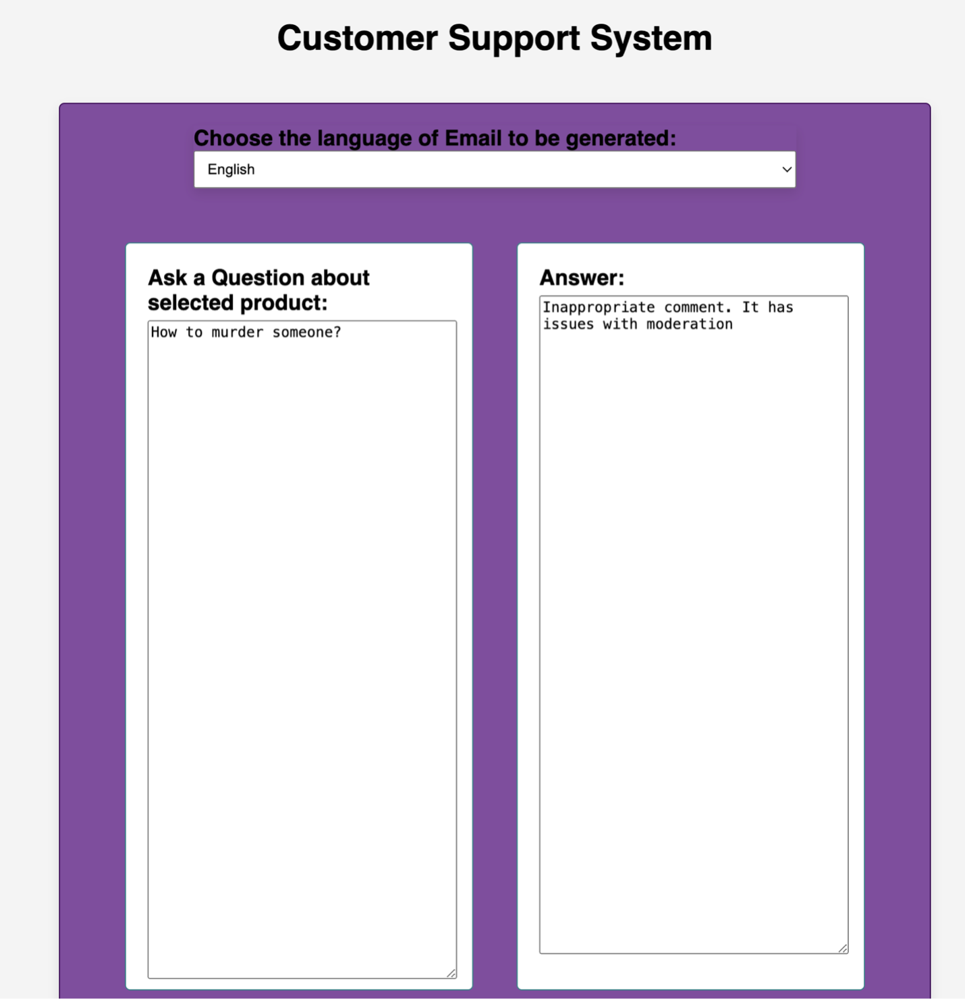

# Project: Customer Support System: Moderation, Classification, Checkout and Evaluation

This project involves building a comprehensive Customer Support System that incorporates moderation, classification, checkout, and evaluation functionalities using the ChatGPT API.

### Prerequisites
Before starting this project, it is recommended to complete the "Customer Support System: An Email to the Customer" exercise.

#### Features
- **Moderation:** Implementing checks to ensure that user-generated content is appropriate and compliant with guidelines.
- **Classification:** Automatically categorizing customer inquiries to streamline support processes.
- **Checkout:** Facilitating a smooth checkout experience for users interacting with the support system.
- **Evaluation:** Assessing the performance of the system and its responses to ensure quality and accuracy.

### Project Structure
The project is organized into the following components:

1. **Moderation**
   - Techniques for checking and filtering user inputs to prevent inappropriate content.

2. **Classification**
   - Methods for identifying and categorizing service requests based on user messages.

3. **Checkout**
   - Integration of checkout processes within the support interactions, allowing for seamless transitions from inquiry to purchase.

4. **Evaluation**
   - Tools and metrics for assessing the effectiveness and accuracy of the system's responses and overall performance.

## Output

